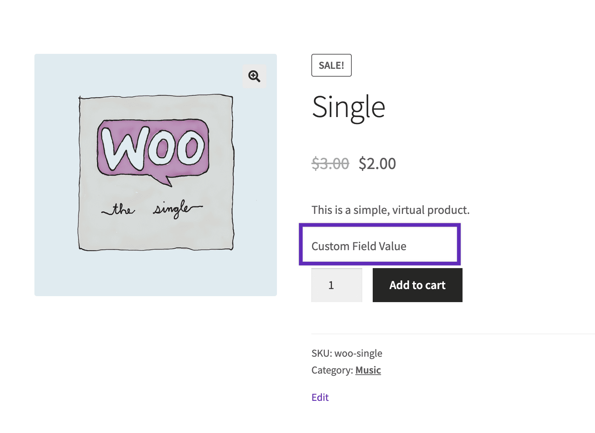

# Displaying custom fields in your theme or site

You can use the metadata from custom fields you add to your products to display the added information within your theme or site.

To display the custom fields for each product, you have to edit your theme’s files. Here’s an example of how you might display a custom field within the single product pages after the short description:



```php
<?php

// Display a product custom field within single product pages after the short description 

function woocommerce_custom_field_example() {

    if ( ! is_product() ) {
        return;
    }
   
    global $product;

    if ( ! is_object( $product ) ) {
        $product = wc_get_product( get_the_ID() );
    }

    $custom_field_value = get_post_meta( $product->get_id(), 'woo_custom_field', true );
    
    if ( ! empty( $custom_field_value ) ) {
       echo '<div class="custom-field">' . esc_html( $custom_field_value ) . '</div>';
    }
}

add_action( 'woocommerce_before_add_to_cart_form', 'woocommerce_custom_field_example', 10 );
```
